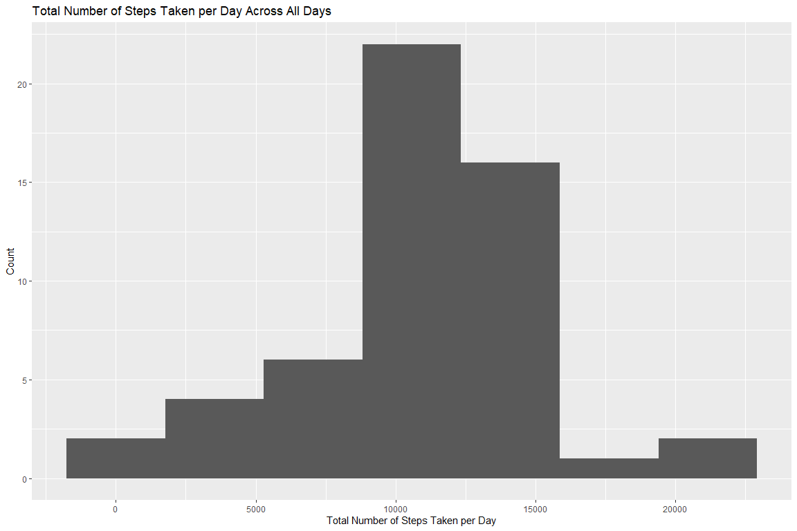
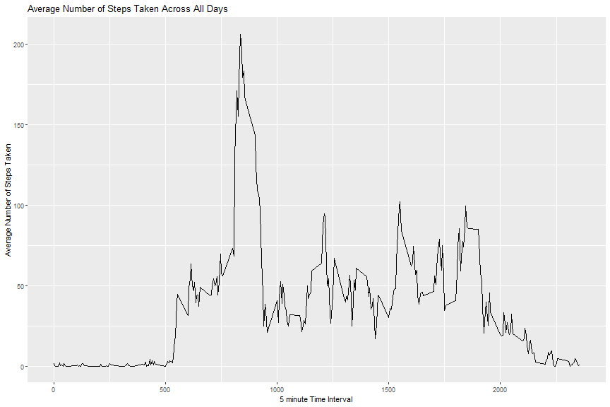
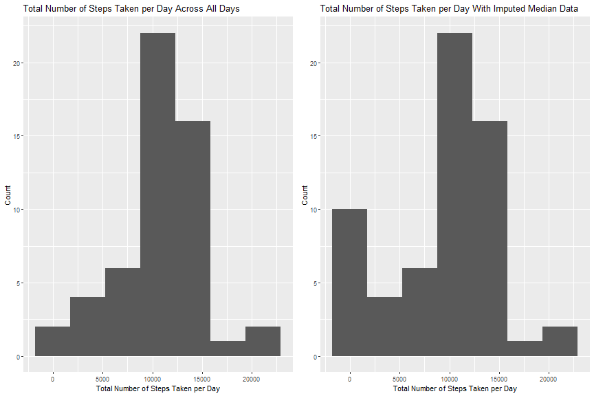
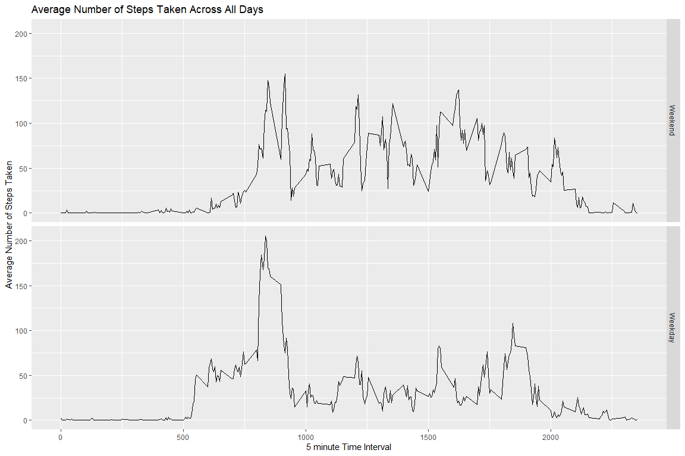

## Loading and preprocessing the data
We will start by loading the required packages for processing and graphing during this project.

```r
require(readr)
require(dplyr)
require(ggplot2)
require(tidyr)
require(imputeMissings)
require(gridExtra)
```

The data is read into R below using read_csv (which will allow for automatic 
Date processing), and the top few lines can be seen below as reference.

```r
data <- read_csv("activity.zip")
head(data)
```

```
## # A tibble: 6 x 3
##   steps date       interval
##   <dbl> <date>        <dbl>
## 1    NA 2012-10-01        0
## 2    NA 2012-10-01        5
## 3    NA 2012-10-01       10
## 4    NA 2012-10-01       15
## 5    NA 2012-10-01       20
## 6    NA 2012-10-01       25
```


## What is mean total number of steps taken per day?
The data is modified to be grouped by day, so the sum of steps in each day can
be calculated. This is then graphed in a histogram, using Sturge's Rule for the
number of bins (k = 1 + 3.22 * log10(n))

```r
daily_steps <- data %>%
      select(steps,date) %>%
      group_by(date) %>%
      summarize(steps = sum(steps))

Histogram <- ggplot(daily_steps, aes(x=steps)) +
      geom_histogram(bins=ceiling(1+3.22*log10(nrow(daily_steps)))) +
      labs(x = "Total Number of Steps Taken per Day",
           y = "Count",
           title = "Total Number of Steps Taken per Day Across All Days")
Histogram
```



The mean of the total number of steps taken per day is **10766.19**.  
The median of the total number of steps taken per day is **10765**.    


## What is the average daily activity pattern?
We will make a time series plot of the 5-minute interval (x-axis) and the average
number of steps taken, averaged across all days (y-axis).

```r
interval_steps <- data %>%
      select(steps,interval) %>%
      group_by(interval) %>%
      summarize(steps = mean(steps, na.rm=TRUE))

ggplot(interval_steps,aes(x=interval, y=steps)) +
      geom_line() +
      labs(x = "5 minute Time Interval",
           y = "Average Number of Steps Taken",
           title = "Average Number of Steps Taken Across All Days")
```



The 5-minute interval that averages the most number of steps across all days is 
**835** with 
**206.17** steps.    


## Imputing missing values
The total number of rows with missing values, from the original data set is **2304**.  
This can be verified in the summary below:  

```r
summary(data)
```

```
##      steps           date               interval   
##  Min.   :  0    Min.   :2012-10-01   Min.   :   0  
##  1st Qu.:  0    1st Qu.:2012-10-16   1st Qu.: 589  
##  Median :  0    Median :2012-10-31   Median :1178  
##  Mean   : 37    Mean   :2012-10-31   Mean   :1178  
##  3rd Qu.: 12    3rd Qu.:2012-11-15   3rd Qu.:1766  
##  Max.   :806    Max.   :2012-11-30   Max.   :2355  
##  NA's   :2304
```

As a simple imputation for these NA values, we can use the median value for each 
interval. I spread the data out so that I can calculate the median per interval,
rather than getting just the overall median.

Luckily there are packages that make imputing much easier. The code below is from 
the "imputeMissings" package in R, and by default will imput via "mean/median".

```r
spread_df <- spread(data, key=interval, value=steps)
imputed_data <- impute(spread_df, compute(spread_df))
colnames(imputed_data) <- colnames(spread_df)
imputed_data <- gather(imputed_data, key="interval", value="steps", -date)
imputed_data$interval <- as.numeric(imputed_data$interval)
imputed_data <- imputed_data %>% select(steps, date, interval)
```

We can see the summary of the new imputed data (with no NA values), and the 
original data below:

```r
sum(is.na(imputed_data$steps))
```

```
## [1] 0
```

```r
summary(imputed_data)
```

```
##      steps          date               interval   
##  Min.   :  0   Min.   :2012-10-01   Min.   :   0  
##  1st Qu.:  0   1st Qu.:2012-10-16   1st Qu.: 589  
##  Median :  0   Median :2012-10-31   Median :1178  
##  Mean   : 33   Mean   :2012-10-31   Mean   :1178  
##  3rd Qu.:  8   3rd Qu.:2012-11-15   3rd Qu.:1766  
##  Max.   :806   Max.   :2012-11-30   Max.   :2355
```

```r
summary(data)
```

```
##      steps           date               interval   
##  Min.   :  0    Min.   :2012-10-01   Min.   :   0  
##  1st Qu.:  0    1st Qu.:2012-10-16   1st Qu.: 589  
##  Median :  0    Median :2012-10-31   Median :1178  
##  Mean   : 37    Mean   :2012-10-31   Mean   :1178  
##  3rd Qu.: 12    3rd Qu.:2012-11-15   3rd Qu.:1766  
##  Max.   :806    Max.   :2012-11-30   Max.   :2355  
##  NA's   :2304
```

Now, we repeat our process from the beginning of this report, plotting a histogram 
of the total number of steps taken per day, and calculating the mean and median 
total number of steps taken per day.  


```r
imputed_daily_steps <- imputed_data %>%
      select(steps,date) %>%
      group_by(date) %>%
      summarize(steps = sum(steps))

Imputed_Histogram <- ggplot(imputed_daily_steps, aes(x=steps)) +
      geom_histogram(bins=ceiling(1+3.22*log10(nrow(daily_steps)))) +
      labs(x = "Total Number of Steps Taken per Day",
           y = "Count",
           title = "Total Number of Steps Taken per Day With Imputed Median Data")
grid.arrange(Histogram, Imputed_Histogram, nrow = 1)
```



The mean of the total number of steps taken per day of the imputed data is 
**9503.87**. The original non-imputed 
data was **10766.19**.  
The median of the total number of steps taken per day of the imputed data is 
**10395**. The original non-imputed 
data was **10765**.  

It's pretty clear that imputing the data has led to some changes from the original 
data set. We have a higher number of low-value steps taken, now.

## Are there differences in activity patterns between weekdays and weekends?

We start off by adding in a factor variable to our Imputed data set, signifying 
whether the date is a Weekday or Weekend.

```r
weekday_data <- imputed_data %>%
      mutate(weekday = factor(
            weekdays(date) %in% c("Monday","Tuesday","Wednesday","Thursday","Friday"),
            levels=c(FALSE,TRUE), labels=c("Weekend", "Weekday"))) %>%
      group_by(interval, weekday) %>%
      summarize(steps = mean(steps, na.rm = TRUE))
```

Below is a time-series plot of the data, faceted by the weekday or weekend factor:

```r
ggplot(weekday_data,aes(x=interval, y=steps)) +
      geom_line() +
      facet_grid(weekday~.) +
      labs(x = "5 minute Time Interval",
           y = "Average Number of Steps Taken",
           title = "Average Number of Steps Taken Across All Days")
```



There appears to be a higher peak during the weekday mornings, but the weekends 
appear to have a bit higher sustained peaks throughout the day. The weekday also 
starts a little earlier, but both weekday and weekends appear to end around the 
same time.  
  


